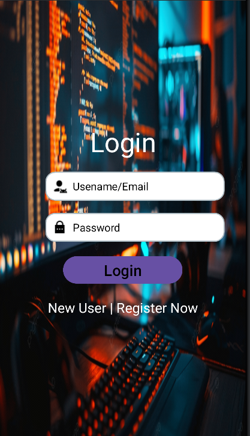
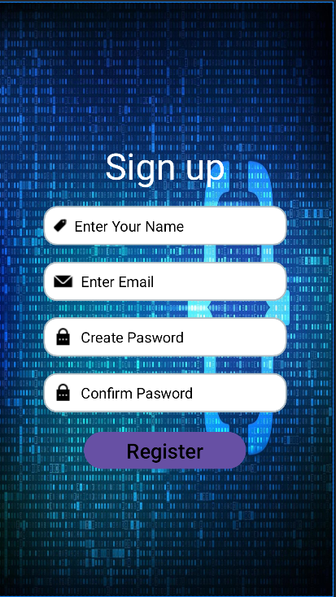
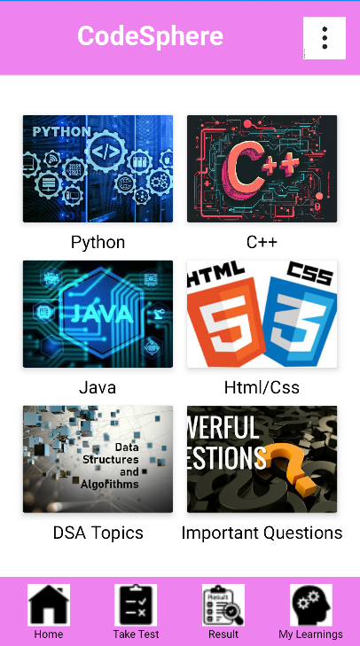
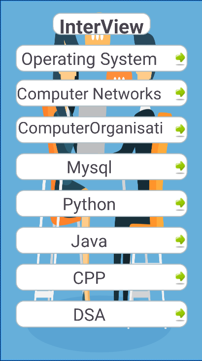

# 🚀 Coding Prep - Android App for Interview & Learning Preparation

**Coding Prep** is an Android application designed especially for students and job seekers. It offers a wide range of computer fundamentals, programming language tutorials, aptitude preparation, and test-taking features – all in one place!

## 📸 Screenshots

<div style="display: flex; gap: 10px; flex-wrap: wrap;">
  <div>
    
    <p><strong>Login Screen</strong></p>
  </div>
  <div>
    
    <p><strong>Sign up Screen</strong></p>
  </div>
  <div>
    
    <p><strong>Dashboard with Learning Topics</strong></p>
  </div>
  <div>
    
    <p><strong>Interview Questions Screen</strong></p>
  </div>
</div>


---

## 📱 Features Implemented

- 🔐 **User Authentication** with Firebase
- 📝 **Registration/Login** functionality
- 📚 Learn multiple programming languages:
  - Python
  - C++
  - Java
  - HTML/CSS
- 📘 **Interview Preparation Questions**
- 🧠 **Data Structures & Algorithms** overview
- 📖 **Reasoning and Aptitude** content
- 🧪 **Online Tests** and **Result Tracking**
- 📚 **Book Suggestions** based on user interests

---

## 🔮 Future Enhancements

- 📊 Visualizations for programming concepts  
- 🎙️ Mock Interview booking system  
- 🧾 Student resource materials  
- 🏛️ Government exam preparation subjects  
- 🎓 Personal study planner  

---

## 🛠️ Tech Stack

- **Frontend**: XML  
- **Backend**: Java  
- **Authentication & Database**: Firebase Authentication & Firebase Firestore  
- **IDE**: Android Studio  

---

## 🚀 Getting Started

Follow these steps to run the project locally:

1. **Clone the repository**  
   ```bash
   git clone https://github.com/your-username/coding-prep.git
   cd coding-prep
   ```

2. **Open in Android Studio**  
   Open Android Studio → Open an Existing Project → Select the cloned folder.

3. **Sync Gradle**  
   Let Android Studio automatically sync and download dependencies.

4. **Setup Firebase**  
   - Create a project in Firebase console.
   - Add Android app with your package name.
   - Download `google-services.json` and place it in the `app/` directory.
   - Enable **Authentication** (Email/Password) and **Firestore** in Firebase Console.

5. **Run the app** on an emulator or real device.

---

## 🤝 Contributions

If you'd like to contribute, feel free to fork the repo and submit a pull request. Suggestions and feedback are always welcome!

---

## 📄 License

This project is under the [MIT License](LICENSE).

---

## 🙌 Acknowledgements

- Firebase for backend services  
- Open-source resources for icons and design inspiration  
- Android Developer community 💙
